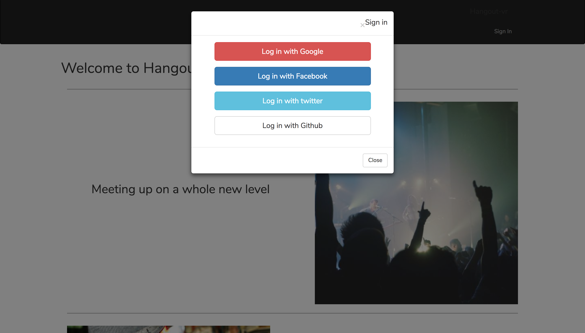
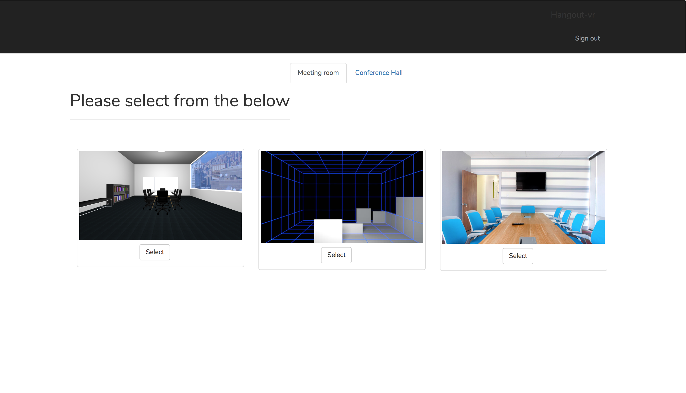
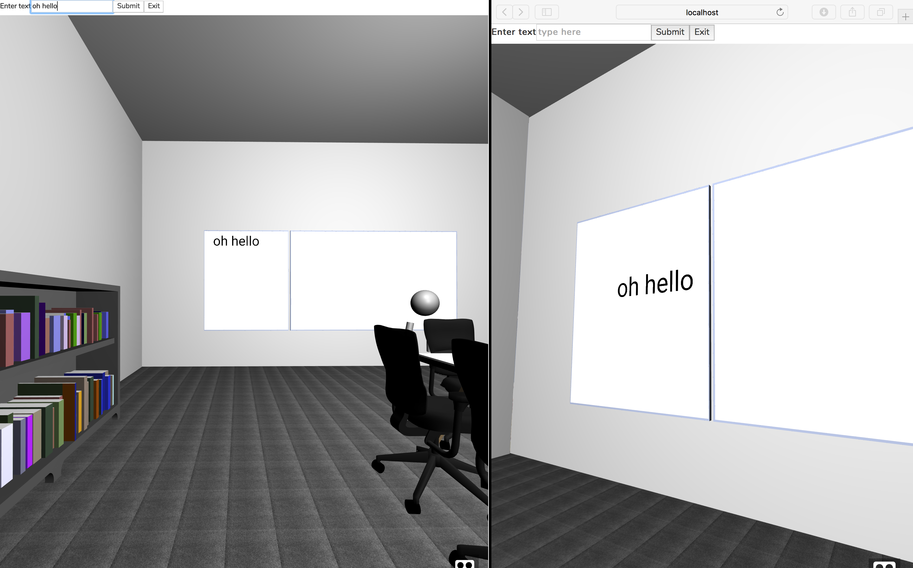

# Hangout-webVR

Virtual-Reality based platform designed for multiple users to meet up virtually anywhere as long as they have access to the web.

Current functionality includes
- text chat

Future Functionalities
- file upload for file/presentation sharing
- chat to other users via microphones
- virtual screen hover and is fixed to each users camera
- physical interactions including object pick-up and hand-off to other users.

### Technologies used

* [React](https://reactjs.org/) - Front-end web library
* [React-bootstrap](https://react-bootstrap.github.io/) - Bootstrap styling web framework
* [Aframe-vr](https://aframe.io/) - Web-based virtual reality framework
* [Node.js](https://nodejs.org/en/) - Server-side scripting
* [Firebase](https://firebase.google.com/) - NoSQL cloud database

### Deployed Site
[Firebase](https://hangout-vr-debed.firebaseapp.com)

* Login page 
* Choosing a scene 
* Multiple user in one room 
* Each user can chat on the whiteboard 
* Short clip 
